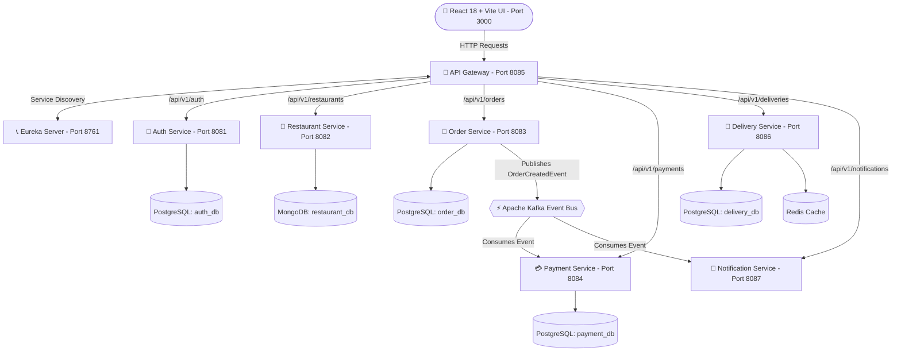

# 🍕 Zomato Microservices — Enterprise Food Delivery Platform

A full-stack, distributed food delivery microservices platform inspired by Zomato, built with **Java 21**, **Spring Boot 3.2.2**, **Spring Cloud 2023**, **Apache Kafka**, **Polyglot Databases (PostgreSQL, MongoDB, Redis)**, and a **React 18 + Vite** Frontend.

---

## 🏗️ System Architecture & Workflow



---

## 📊 Microservices Catalog & Port Allocations

| Service Name | Port | Description | Database / Storage |
| :--- | :--- | :--- | :--- |
| **`eureka-server`** | `8761` | Netflix Eureka Service Registry & Health Dashboard | In-Memory Registry |
| **`api-gateway`** | `8085` | Spring Cloud Gateway (CORS, Rate Limiting, Route Forwarding) | - |
| **`auth-service`** | `8081` | User Registration, BCrypt Hashing, JWT Token Generation | PostgreSQL (`auth_db:5431`) |
| **`restaurant-service`** | `8082` | Restaurant Profile & Dynamic Food Menu Management | MongoDB (`restaurant_db:27017`) |
| **`order-service`** | `8083` | Food Order Placement, Cart Checkout, Status Updates | PostgreSQL (`order_db:5432`) + Kafka |
| **`payment-service`** | `8084` | Payment Transaction Processing & Receipts | PostgreSQL (`payment_db:5433`) + Kafka |
| **`delivery-service`** | `8086` | Driver Assignments & Real-time GPS Location Caching | PostgreSQL (`delivery_db:5434`) + Redis (`6379`) |
| **`notification-service`**| `8087` | WebSocket & Push Alert Dispatcher | Apache Kafka Event Bus |
| **`frontend-app`** | `3000` | Single Page Application (Customer, Owner & Driver Portals) | React 18 + Vite |

---

## 💾 Database Strategy (Polyglot Persistence)

* **PostgreSQL (Relational/SQL)**: Used for `auth`, `order`, `payment`, and `delivery` services where ACID compliance, foreign keys, and financial transaction integrity are critical.
* **MongoDB (NoSQL)**: Used for `restaurant-service` because food menus require flexible, deeply nested JSON document structures (variations, toppings, dynamic prices).
* **Redis**: In-memory cache for high-speed live GPS updates from delivery partners (`driver_locations`).
* **Apache Kafka**: Asynchronous event streaming platform for decoupled microservice communication (`order-events` topic).

---

## 🔐 Security Architecture

1. **Stateless JWT Tokens**: Users authenticate against `/api/v1/auth/login`. Upon success, `auth-service` returns a digitally signed JWT token.
2. **Spring Security**: Protects password storage via `BCryptPasswordEncoder`.
3. **Global Gateway CORS**: Spring Cloud Gateway is configured to allow authenticated Cross-Origin requests from the React frontend (`http://localhost:3000`).

---

## 🚀 How to Run the Project Locally

### 1️⃣ Start Infrastructure Containers
Ensure Docker Desktop is running, then execute in project root:
```bash
docker compose up -d
```

### 2️⃣ Launch Spring Boot Microservices (via IntelliJ IDEA)
Run the main classes in the following order:
1. `EurekaServerApplication.java` (`http://localhost:8761`)
2. `ApiGatewayApplication.java` (`http://localhost:8085`)
3. `AuthServiceApplication.java`
4. `RestaurantServiceApplication.java`
5. `OrderServiceApplication.java`
6. `PaymentServiceApplication.java`
7. `DeliveryServiceApplication.java`
8. `NotificationServiceApplication.java`

### 3️⃣ Launch React Frontend
```bash
cd frontend-app
npm install
npm run dev
```
Open **`http://localhost:3000`** in your browser!

---

## 💻 Tech Stack
* **Language**: Java 21, JavaScript (ES6+)
* **Framework**: Spring Boot 3.2.2, Spring Cloud 2023.0.0, React 18
* **Build Tools**: Maven, Vite
* **Databases**: PostgreSQL 16, MongoDB 7, Redis 7
* **Event Broker**: Apache Kafka + Zookeeper
* **Service Discovery**: Spring Cloud Netflix Eureka
* **API Gateway**: Spring Cloud Gateway (Netty / WebFlux)
